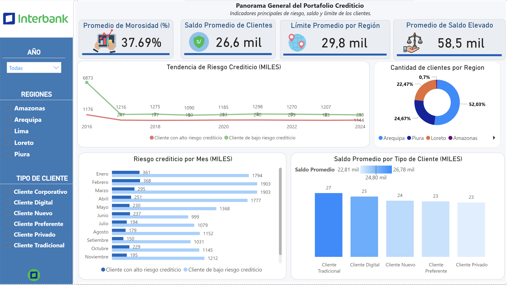

# Mi informe en Power BI
## Dashboard de Riesgo Crediticio

Este dashboard permite analizar y monitorear el portafolio crediticio de los clientes, con filtros por **año** y **tipo de cliente**. Consta de tres páginas principales:

---

## 1️⃣ Panorama General del Portafolio Crediticio
**Objetivo:** Brindar una visión resumida y rápida del estado del portafolio crediticio.  

**Qué muestra:**  
- Indicadores principales de riesgo (bajo, medio, alto).  
- Saldo total de los clientes y límites de crédito disponibles.  

**Uso de filtros:**  
- **Año:** Analiza el portafolio de un período específico y permite comparaciones año a año.  
- **Tipo de cliente:** Diferencia entre clientes individuales y corporativos (o categorías definidas), mostrando la distribución del riesgo y los saldos.  

**Valor agregado:** Permite un diagnóstico rápido del portafolio, identificar alertas de riesgo y tomar decisiones estratégicas de gestión de crédito.  

---

## 2️⃣ Análisis del Perfil y Comportamiento del Cliente
**Objetivo:** Entender cómo las características de los clientes impactan en el riesgo y comportamiento crediticio.  

**Qué muestra:**  
- Indicadores segmentados por región, antigüedad laboral, nivel de educación y nivel de riesgo.  
- Detecta patrones de comportamiento y riesgo según los distintos perfiles.  

**Uso de filtros:**  
- **Año:** Evalúa la evolución de los perfiles a lo largo del tiempo.  
- **Tipo de cliente:** Permite analizar si los patrones de riesgo o comportamiento varían entre tipos de clientes.  

**Valor agregado:** Facilita estrategias de segmentación, campañas de prevención de riesgo y personalización de productos financieros.  

---

## 3️⃣ Evolución Temporal del Portafolio Crediticio
**Objetivo:** Visualizar cómo ha cambiado el portafolio a lo largo del tiempo y detectar tendencias.  

**Qué muestra:**  
- Evolución del saldo total, número de clientes y morosidad.  
- Identifica tendencias de crecimiento, estancamiento o deterioro del portafolio.  

**Uso de filtros:**  
- **Año:** Permite concentrarse en períodos específicos o comparar años consecutivos.  
- **Tipo de cliente:** Analiza la evolución según el tipo de cliente, ayudando a focalizar estrategias de gestión y prevención de riesgos.  

**Valor agregado:** Monitorea la salud del portafolio y anticipa riesgos futuros, evaluando la efectividad de las políticas de crédito implementadas.  

